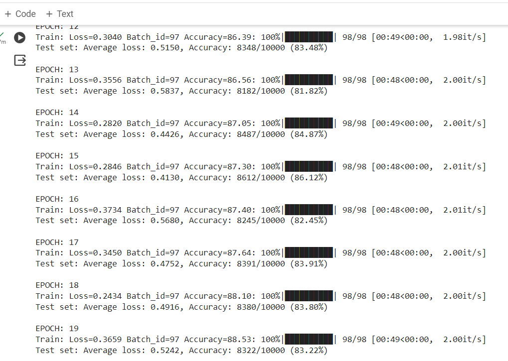
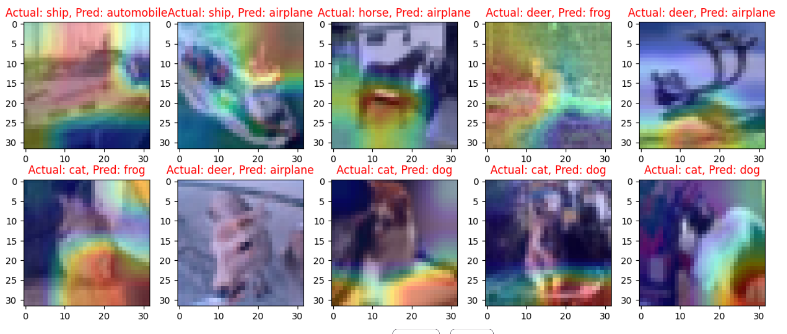

# Assignment 11

# Problem Statement

To train RESNET18 for CIFAR10 dataset with the mentioned repo structure

1. train resnet18 for 20 epochs on the CIFAR10 dataset
2. show loss curves for test and train datasets
3. show a gallery of 10 misclassified images
4. show gradcamLinks to an external site. output on 10 misclassified images.

# File Structure

repo contains all the code required during training in different modules
   - resnet18_model.py -> Contains the architecture
   - uitls.py -> contains supportive functions for code
   - main.py -> main py file 
   - S11.ipynb -> contains the execution of code 

# Model observations
 
# Training Logs

    

Misclassified images

    

Misclassified images visualied using gradcam

    

       

# Results

  Test Accuracy : 83%
  Train Accuracy : 88.53%

